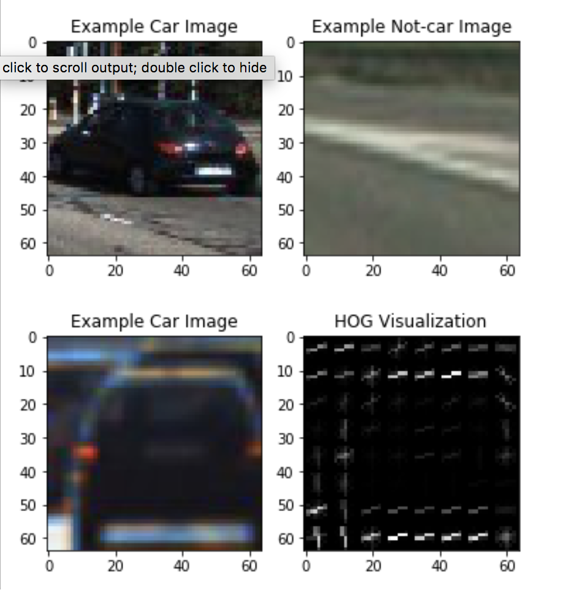
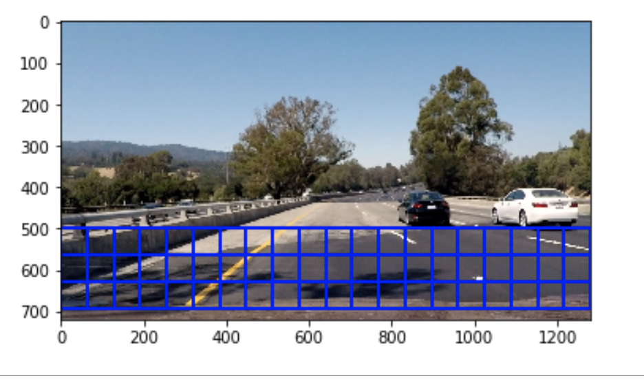
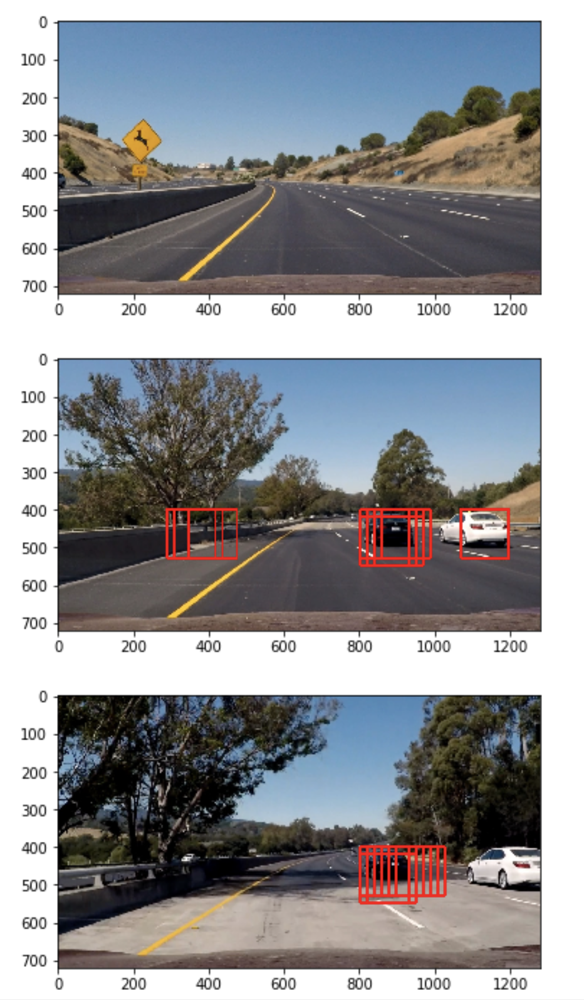
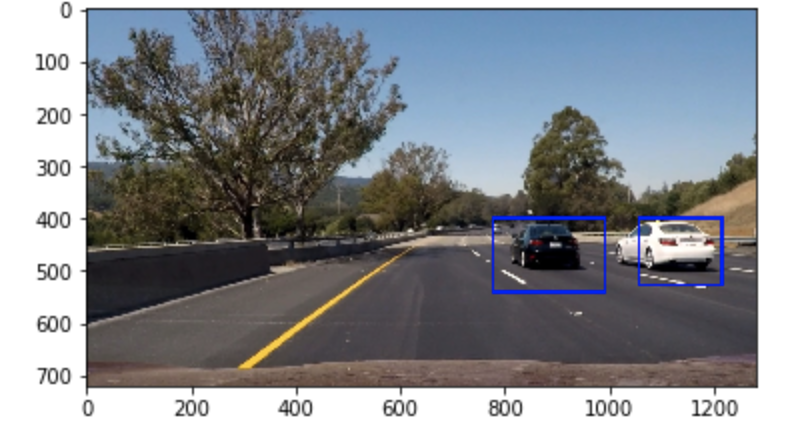

# Vehicle Detection
[](http://www.udacity.com/drive)


### The goals / steps of this project are the following:

* Perform a Histogram of Oriented Gradients (HOG) feature extraction on a labeled training set of images and train a Linear SVM classifier
    * Apply a color transform and append binned color features, as well as histograms of color, to your HOG feature vector. 
* Implement a sliding-window technique and use your trained classifier to search for vehicles in images.
* Run your pipeline on a video stream (start with the test_video.mp4 and later implement on full project_video.mp4) and create a heat map of recurring detections frame by frame to reject outliers and follow detected vehicles.
* Estimate a bounding box for vehicles detected.


### Rubric Point

* Here I will consider the rubric points individually and describe how I addressed each point in my 
  implementation.

*** File submission inculde all the required files that are necessary to quialy the project submission ***

   1) project.ipynb
   2) Readme.md
   3) Writeup.
   
#### Below are the steps described individually that are implement in the project


1) HOG feature
2) Extract Feature(SVC , CLF Results)
3) Sliding Windows
4) Pipeline Explanation

#### 1) HOG feature  is called Histogram of Oriented Gradient 
* It has very import task in prediction as it helps to get 
* It mainly consist of gradient , magnitued and direction 
* Grouping these individual values into small group of cells 
* And classifing from almost 9 orients bins to get the result 
* and then combining again the each pixel 
     

#### 2) Extraction Feature 
* It combine spatial feature , hist_feature and hog_feature 
* below are the parameter used by me for bestresults 
---
```python

    color_space = 'YCrCb' # Can be RGB, HSV, LUV, HLS, YUV, YCrCb
    orient = 9  # HOG orientations
    pix_per_cell = 8 # HOG pixels per cell
    cell_per_block = 2 # HOG cells per block
    hog_channel = "ALL" # Can be 0, 1, 2, or "ALL"
    spatial_size = (32, 32) # Spatial binning dimensions
    hist_bins = 32    # Number of histogram bins
    spatial_feat = True # Spatial features on or off
    hist_feat = True # Histogram features on or off
    hog_feat = True # HOG features on or off

```
---

      * Later is applied SVC and CLF , I prefered CLF over SVC as it has more accuray in practical over CVC while i            was using it in my project video in order to detect the cars   
 
_*result after extracting feature and applying SVC along with CLF *_ 
---
```

Using: 9 orientations 8 pixels per cell and 2 cells per block
Feature vector length: 8460
0.7 Seconds to train SVC...
Test Accuracy of SVC =  1.0
179.53 Seconds to train CLF...
Test Accuracy of SVC =  1.0
My CLF predicts:  [ 0.  0.  1.  1.  1.  1.  0.  0.  0.  0.]
For these 10 labels:  [ 0.  0.  1.  1.  1.  1.  0.  0.  0.  0.]
0.078 Seconds to predict 10 labels with CLF

```
---
####  3) Sliding Windows

* For sliding window mutliple function has been used like sliding_windows function itself, search_windows which further consist of single_img_features but I have used another function such as find_cars() which was used  during the process of reading frame one by one and applying prediction 







search_windows_img.png
#### 4) Pipeline Explanation

* process_pipe is the function in which on fund car function is applied vaious time in various axis in order to find the sorrounding cars . rectangles is the varable taken to compress all the rectanges into one rectange which are appended in rects variable of list , using that reactange list I applied add_heat to apply head signle like and then applied threshold on them using apply_threshold  and got the expected result and return the img




##### test video
<video width="400" controls>
  <source src="test_video_out.mp4.mp4" type="video/mp4">
</video>

##### project video
<video width="400" controls>
  <source src="project_video_out.mp4.mp4" type="video/mp4">
</video>


```python

```
